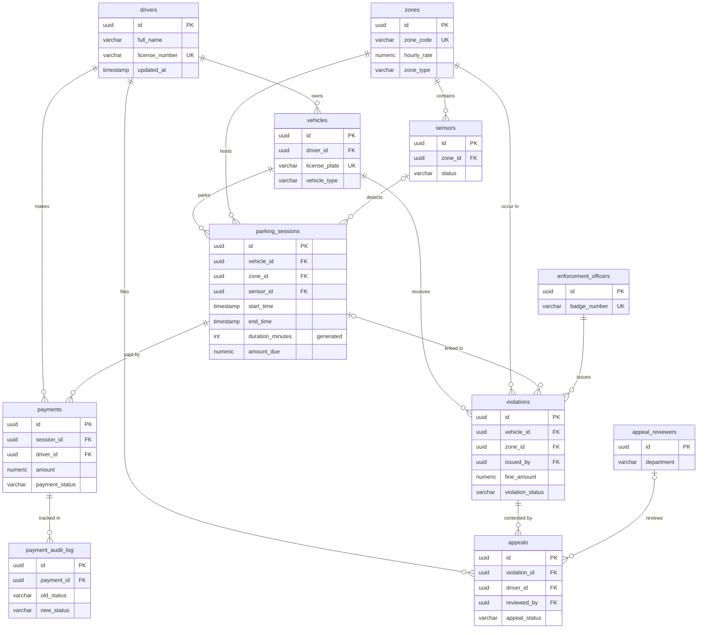

# Smart City Parking — PostgreSQL Database

A relational database for a city parking management system: drivers and vehicles, parking zones with IoT sensors, parking sessions, payments, fines, and appeals. Includes sample data and a collection of 100+ SQL queries.

> University project (Astana IT University, Computer Science). Everything runs locally — no servers or paid services needed.

## What's inside

| | |
|---|---|
| **Tables** | 11, with primary keys (UUID), foreign keys, `UNIQUE`, `NOT NULL` and `CHECK` constraints |
| **Indexes** | 18, on foreign keys and frequently filtered columns |
| **Triggers** | 3 (PL/pgSQL): `updated_at` refresh, payment status audit log, automatic "appealed" flag on fines |
| **Views** | 3: active sessions, outstanding violations, revenue per zone |
| **Other features** | generated column for session duration, `POINT` type for zone coordinates, normalized schema |
| **Sample data** | 100 rows per table (synthetic) |
| **Queries** | 100+ commented queries grouped by topic |

## ER diagram



## Getting started

Requirements: PostgreSQL 13+ (tested on 16) and `psql`.

```bash
git clone <this-repo-url>
cd smart-city-parking

createdb parking
psql -d parking -f sql/01_schema.sql   # tables, indexes, triggers, views
psql -d parking -f sql/02_seed.sql     # 100 sample rows per table
psql -d parking -f sql/03_queries.sql  # run the whole query collection (optional)
```

The query file is meant to be read and run piece by piece. Some statements in section 6 modify data (`ALTER`, `UPDATE`, `DELETE`), so run the file on a scratch database. Queries that use `NOW()` return few or no rows on the sample data, because it covers 2023–2025.

## Query collection (`sql/03_queries.sql`)

| Section | Topics |
|---|---|
| 6. DML and basic queries | `ALTER TABLE`, `UPDATE`, `DELETE`, `ORDER BY`, `LIMIT/OFFSET`, string and date functions |
| 7. Joins | `INNER`, `LEFT`, `RIGHT`, `FULL`, `CROSS`, `NATURAL`, self joins, multi-table chains |
| 8. Filtering and logic | `BETWEEN`, `IN`, `LIKE/ILIKE`, `IS NULL`, `CASE` |
| 9. Aggregation | `COUNT/SUM/AVG/MIN/MAX`, `GROUP BY`, `HAVING`, `ROLLUP`, `GROUPING SETS` |
| 10. Subqueries | scalar, `IN`, correlated, `EXISTS`, `ALL`, row-valued subqueries |

## Try the triggers and views

```sql
-- Changing a payment status writes a row to payment_audit_log automatically
UPDATE payments SET payment_status = 'refunded'
WHERE id = (SELECT id FROM payments WHERE payment_status = 'completed' LIMIT 1);

SELECT * FROM payment_audit_log ORDER BY changed_at DESC LIMIT 1;

-- Revenue per zone
SELECT * FROM v_zone_revenue ORDER BY total_revenue DESC LIMIT 5;
```

## Design notes

- `parking_sessions.duration_minutes` is a generated column computed from `start_time` and `end_time`, so it cannot get out of sync. Because of that, it is left out of the `INSERT` statements.
- Foreign keys are indexed explicitly, since PostgreSQL does not index them automatically.
- Status fields (`session_status`, `payment_status`, and similar) are plain `VARCHAR` columns.

## Possible improvements

- Replace status `VARCHAR` columns with `CHECK` constraints or enum types.
- Add `ON DELETE` rules for `payment_audit_log`, so deleting a payment does not require manual cleanup.
- Add a small application layer (REST API) on top of the schema.

## Project structure

```
smart-city-parking/
├── README.md
└── sql/
    ├── 01_schema.sql    # tables, indexes, triggers, views
    ├── 02_seed.sql      # sample data
    └── 03_queries.sql   # query collection
```
